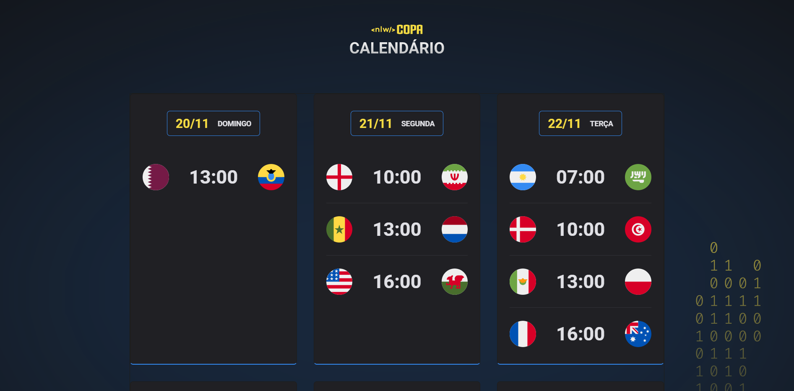

# CALENDARIO DE JOGOS DA COPA DO MUNDO/2022

Projeto realizado no NLW #10 da RockeatSeat com utilização, utilizando diversas tecnologias.

## :rocket: Tecnologias utilizadas:
- HTML e CSS;
- JavaScript;
- Git e GitHub;

## :computer: Projeto:

O calendário da Copa é um projeto onde estão configurados os horários e países que irão competir entre si.

## 🏷️ Layout:

Você pode visualizar o layout do projeto online através desse link 👉 [Projeto Online](https://jessica-pimentel.github.io/Calendario-jogos-da-Copa-2022). 

## :camera: Pré-visualização do projeto:

